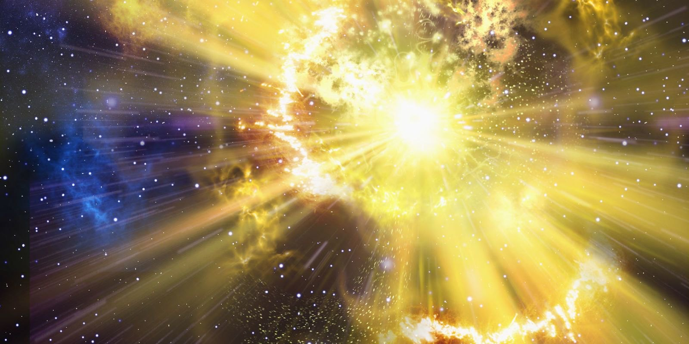
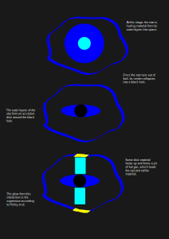
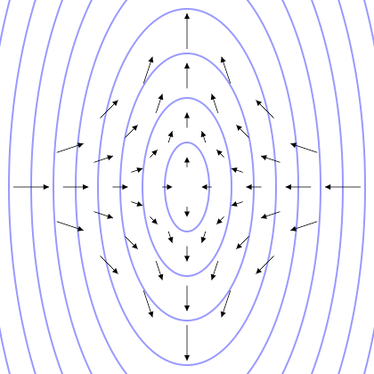
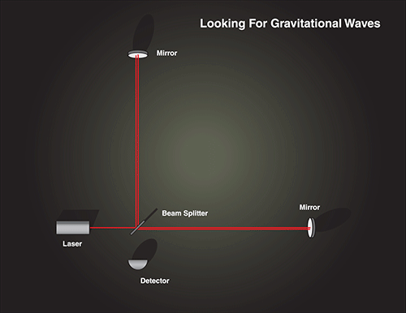
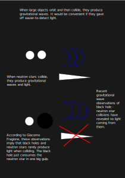

# News On Dead Stars

# Table Of Contents

  
Credit: Robert Sullivan

**[New Type of Supernova Shows How Very Massive Stars Die](#new-type-of-supernova-shows-how-very-massive-stars-die)**  
An article on the classification of a strange supernova and its implications for the deaths of very high-mass stars. This is aimed at those with some background in astronomy, but it's not required.

**[What Happens when a Black Hole hits a Neutron Star?](#what-happens-when-a-black-hole-hits-a-neutron-star)**  
An article on what the new field of gravitational-wave astronomy has allowed us to learn about collisions between neutron stars and black holes. This is aimed at people with little or no astronomy background.

**[Works Cited](Works_Cited.md)**

## About The Author

Josh Ellis is a Computer Science major at CSU, and he took one year of calculus-based
Physics. He achieved 1st place in Regionals in Astronomy for Science Olympiad in
Southern Colorado in 2017. He has also been involved in physics and astronomy
outreach since 2019 as part of the Society of Physics Students.
# New Type of Supernova Shows How Very Massive Stars Die

When stars far more massive than the Sun die, they explode in spectacular supernovae. Well, scientists suspect this happens; they haven't seen enough of these stars to be sure. Recently, a team of astronomers has put us one step closer to the answer with a new type of supernova.

In 2021, thirty-five researchers led by Daniel Perley from universities around the world studied the supernova SN 2021csp. SN 2021csp proved to be so unusual that the researchers think that it should be categorized as a new type of supernova. The proposed explanation for this strange explosion may shine light on how high-mass stars die.

Daniel Perley, the lead author, is a specialist in high-energy events at the Astrophysics Research Institute at Liverpool John Moores University. When they and other researchers spotted this supernova, they tried as many ways to look at it as possible.

In order to study SN 2021csp, the researchers used many different telescopes to gather light from this supernova for analysis. First, Perley and their team narrowed down exactly when the explosion started using early observations of the supernova's brightening. Once the researchers had the explosion time, they could use the large amount of data collected to figure out other properties of the supernova.

An important step in the observation process was to break down the light into its various wavelengths. This allowed the researchers to use a technique known as spectral analysis to learn all sorts of properties of the explosion. Spectral analysis revealed the temperature of the explosion, the speed that the material was thrown from the explosion, and even what the exploding material was made of.

The analysis revealed a very unusual composition for a supernova. SN 2021csp had a lot of carbon and oxygen, but it had little helium and no hydrogen whatsoever. Since most stars are made mostly of hydrogen and helium, this is pretty weird. In addition, further analysis showed that the supernova light was produced by dense material already around the original star; this is strange since space isn't usually very dense.

Explaining how this occurred is tricky. After ruling out other possible explanations, Perley and their team propose that the following process happened:

> The star that ultimately created this supernova was in the last phases of its life. It was so bright that it ejected large amounts of itself into space, making the area around it full of stellar material. Stars this old have hydrogen only in their outer regions, so this star would have already ejected most of its hydrogen far away from any potential explosion.

So far, this isn't new; astronomers already knew about stars like this called Wolf-Rayet stars. What is new is what the authors think happened next.

> The center of the star ran out of fuel and could no longer resist gravity. In smaller stars between 8 and 20 times the mass of the Sun, the center would have collapsed and released enough energy to cause the star to explode, but this star was too large for that. Instead, the center collapsed directly into a black hole. The rest of the star, with no support, attempted to fall into the new black hole and formed a disk of matter, known as an accretion disk, around the black hole. As the disk spiraled into the black hole, friction caused it to heat up to scorching temperatures, which caused some to be sprayed out as jets of hot matter. When these jets hit the previously ejected material, the material glowed, resulting in the strange spectrum seen by the researchers.

---

### Infographic: How Very High-Mass Stars Might Die

In 2021, a team of 35 researchers led by Daniel Perley from various universities conducted a study on the unusual supernova SN 2021csp. This supernova gives insight on the mysterious deaths of very high-mass stars. Here is a model for how the authors think it occurred.

---

This new model may explain how very high-mass stars die. While this research is exciting, it is worth being cautious about it. The researchers are far from certain that their model is correct. To find out for sure, astronomers will have to find more of these kinds of supernovae, which will take many years. In 15 years, we may look back at this supernova as a crucial clue.

Knowing how this process occurs is vital for astronomers for several reasons. The first stars to form were very high-mass, often with over 100 times the mass of the Sun. Understanding how these stars died is important for knowing how elements heavier than hydrogen and helium were formed. This includes many of the atoms in your body right now. In addition, these high-mass star deaths may explain how the supermassive black holes at the centers of galaxies formed. Learning more about this process is vital to our knowledge of the Universe.
# What Happens when a Black Hole hits a Neutron Star?

## What are Gravitational Waves?

When massive stars die, they explode in spectacular supernova explosions that outshine entire galaxies. While the outer layers of the star are ejected into space, the central core of the star remains. For lighter stars, the core turns into a giant ball of neutrons known as a neutron star. The material of neutron stars is so dense that a cube of it the size of a 6-sided die would contain as much mass as all of humanity! For heavier stars, the core is so heavy that it just collapses into a black hole. A black hole is a region of space where gravity is so intense that light cannot escape. So, what happens when a black hole collides with a neutron star?

In order to find out, scientists have been detecting gravitational waves. Gravitational waves are a completely new way of looking at our Universe. Normally, our telescopes look at light (although sometimes in wavelengths humans cannot see). Gravitational waves allow us to detect new types of events that we cannot see using light (e.g. black hole collisions). Gravitational waves are very difficult to detect, so scientists have only been able to observe them recently. The first gravitational wave detection was done by the Laser Interferometer Gravitational-Wave Observatory (LIGO). LIGO has two facilities in the U.S.: one in Washington state and another in Louisiana. This first detection took place in 2015.

To understand why it took scientists until recently to find gravitational waves, we must understand exactly what they are. In order to understand gravitational waves, we must first understand the gravitational field. The gravitational field is simply the direction and strength of gravity. For instance, the gravitational field on Earth accelerates all objects towards its center at around 35 kilometers per hour per second. Since mass generates gravity, mass shaking around, such as two objects orbiting and then colliding, generates ripples in the gravitational field. These ripples are gravitational waves. These waves alter the gravitational field; they stretch and squeeze anything in their path as shown in the animation below.

  
"[File:Quadrupol Wave.gif](https://en.wikipedia.org/wiki/File:Quadrupol_Wave.gif)" by Raoul NK is licensed under [CC BY-SA 3.0](https://creativecommons.org/licenses/by-sa/3.0/deed.en).  

In order to detect this squeezing, scientists use lasers to measure two arms. When a gravitational wave passes by, as shown in the animation below, it very slightly changes the lengths of the arms; this results in a detectable signal.

  
Credit: NASA Space Place

The signal is shockingly weak as demonstrated by the first detection of gravitational waves. This event is called GW150914 since it was detected on September 14, 2015. GW150914 resulted from two black holes colliding; this released an enormous amount of energy. The event was so far away that the gravitational waves, which travel at the speed of light, took 1.3 billion years to get to Earth. GW150914 only gave off gravitational waves, but imagine for a moment that it had emitted all of its energy as easier-to-detect light instead. Even from that distance, it would have been easily seen without any equipment during the daytime. This is because, for a fraction of a second, GW150914 gave off 7 billion trillion times as much power as is given off by the Sun! Despite this insane power output, the actual gravitational waves shifted LIGO's 4-km-long arms by less than 1% of the diameter of a proton. The required precision is why scientists could only detect gravitational waves recently.

In 2021, LIGO and a collaborator observatory Virgo announced that, using gravitational waves, they had found two neutron star-black hole collisions which generated the events GW200105 and GW200115. Like with GW150914, the team found no light counterparts to either of these.

As a result of these events, two recent studies have been published which can help us to better understand neutron star-black hole collisions. In 2021, two astronomers from Harvard University, Floor S. Broekgaarden and Edo Berger, conducted a study on how stars form binary pairs of black holes and neutron stars. Also in 2021, Giacomo Fragione, an astrophysicist at Northwestern University, conducted a study on whether black hole-neutron star collisions produce easier-to-detect light. By comparing these two studies, we can learn just how much can be learned from simulations and how scientists treat phenomena they have only observed a few times.

## Why would Black Holes and Neutron Stars collide?

In the first study, the Harvard astronomers wanted to find out how black hole-neutron star systems form. Broekgaarden and Berger found evidence for an existing model called "isolated binary evolution". In this model, massive stars form paired up far away from any other stars. After they explode, they leave behind a black hole and neutron star orbiting each other. The two dead stars then slowly lose energy to gravitational waves and collide; this results in detectable gravitational waves.

The authors used data collected by LIGO on GW200105 and GW200115. The authors wanted to see if the isolated binary evolution model could explain the data. To do so, the authors needed a way to simulate pairs of stars. This was provided for them by the software COMPAS. Here is roughly how it works:
1. Evolve each simulated star one discrete time step and collect data on them.
2. If the star has changed type (e.g. dwarf to giant), update that.
3. Check for any massive disruptions to the stars (e.g. supernova).
4. If the stars are still orbiting each other, go back to Step 1.

By doing this to roughly 30 million simulated pairs of stars, the astronomers were able to find many of the properties that these collisions would have, such as the masses of the bodies, how often these kinds of collisions would occur, and even whether they would produce light.

Broekgaarden and Berger found that this model would explain the data collected by LIGO and how these systems form, but they cautiously pointed out that they could not rule out other models such as stars forming in triples. They conclude that the isolated binary evolution model can explain why these black hole-neutron star collisions happen. While this study attempted to learn why black holes and neutron stars collide, the other attempted to learn what happens when they collide.

## Will We be able to See Black Holes and Neutron Stars collide?

In the second study, Giacomo Fragione, an astrophysicist at Northwestern University, wanted to figure out if black hole-neutron star mergers produce light. Since light would be much easier to detect and learn from, it would be convenient if these kinds of collisions produced it.

Like the first study, Fragione's work looked at information on GW200105 and GW200115 from LIGO as evidence. The study used a very similar simulation to COMPAS known as BSE to see how stars evolved; he even used results from the Harvard astronomers for some of his data. The simulations are very similar, so the process of simulating how stars evolve is more or less identical to the one from the first study.

Since BSE only dealt with how stars evolve and not how they collide, it could not explain what happened when the simulated stars collided. For this part, the author used simulations of the theory of general relativity, our modern theory of gravity, and simulations of neutron stars to see if the black hole's gravity had shredded it to pieces. If so, then the neutron star material would likely heat up due to friction as it fell into the black hole and give off light. As a result, if there was mass left over from the collision, Fragione concluded that it produced light.

Fragione concluded from the simulations that black hole-neutron star collisions are more likely to produce light if the black hole involved is born spinning quickly. The LIGO team that detected GW200105 and GW200115 found that both black holes involved in the collisions had low, if any, spins. From this sample size of 2, Fragione extrapolates to all black hole-neutron star collisions and concludes that they rarely produce light. Instead, according to Fragione, the black hole just swallows the neutron star in one big gulp.

---

### Infographic: What Happens When a Black Hole and Neutron Star Collide?

In 2021, Giacomo Fragione from Northwestern University conducted a study on two collisions, each of a neutron star and a black hole. Here is what he thinks happened.

---

While he may be right, Fragione concluded this after only seeing *two* collisions. Such a conclusion could be compared to you wandering into a room of people, and the only two people you can see are wearing a yellow shirt. From this, you conclude that all 50 of the others in the room are wearing a yellow shirt and head home. You might be right, but it is a fairly reckless conclusion to draw.

## What's Next?

These two studies were similar in certain ways. Both studies used very similar simulations of stellar evolution; as a result, both came to very similar conclusions about the properties of the systems that created GW200105 and GW200115. Both predict low black hole spins, and both predict that light would rarely be produced from black hole-neutron star collisions. It is difficult to create black hole-neutron star collisions in a lab for replication [citation needed], but we will observe more of them using gravitational waves. All of the predictions of these studies can be tested in future observations of black hole-neutron star collisions.

That being said, there are significant differences between the two studies. The most important difference is framing. The Harvard astronomers, Broekgaarden and Berger, framed their findings cautiously. While they made evidence-based predictions, their paper was clear that they may be wrong due to how few black hole-neutron star collisions were observed. In contrast, Fragione was far less cautious. He was quite confident that he was right despite his small sample size and even the caution of the astronomers he built his work on.

One takeaway from this difference is that it is possible to frame conclusions cautiously or with overconfident certainty from the exact same data. This is something to keep in mind when reading new science: are the scientists involved being overconfident, appropriately cautious, or too cautious?

While it appears that the stars that eventually create these collisions form in isolated pairs, we need to observe more collisions to be sure. Research into these collisions, especially any that produce light, will also allow us to learn more about the mysterious insides of neutron stars. Since scientists have only been able to detect gravitational waves for the last few years, we are going to observe and learn a lot about these events over the next 5-10 years. In any case, practice with gravitational wave observations of these events will push our knowledge of the Universe forward in new and exciting ways. These events will show if these papers are right or wrong, but in either case, we will learn what happens when two of the strangest objects in the Universe collide.
